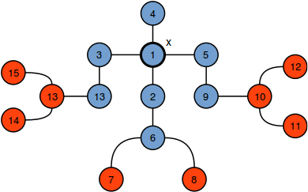
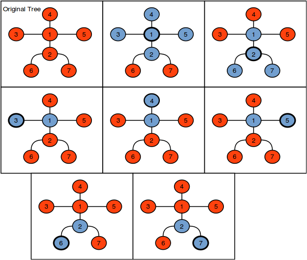
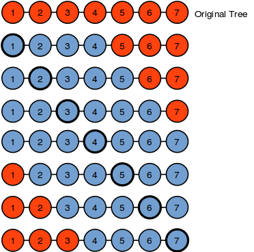

# Jenny's Subtrees

https://www.hackerrank.com/challenges/jenny-subtrees/problem#

> Jenny loves experimenting with [trees](https://en.wikipedia.org/wiki/Tree_%28graph_theory%29). Her favorite tree has `n` nodes connected by `n - 1` edges, and each edge is `1` unit in length. She wants to cut a _subtree_ (i.e., a connected part of the original tree) of radius `r` from this tree by performing the following two steps:
>
> 1. Choose a node, `x`, from the tree.
> 1. Cut a subtree consisting of _all_ nodes which are _not_ further than `r` units from node `x`.
>
> For example, the blue nodes in the diagram below depict a subtree centered at `x = 1` that has radius `r = 2`:
>
> 
>
> Given `n`, `r`, and the definition of Jenny's tree, find and print the number of `different` subtrees she can cut out. Two subtrees are considered to be different if they are not [isomorphic](https://en.wikipedia.org/wiki/Graph_isomorphism).
>
> ## Input Format
>
> The first line contains two space-separated integers denoting the respective values of `n` and `r`.
> Each of the next `n - 1` subsequent lines contains two space-separated integers, `x` and `y`, describing a bidirectional edge in Jenny's tree having length `1`.
>
> ## Constraints
>
> * `1 <= n <= 3000`
> * `0 <= r <= 3000`
> * `1 <= x, y <= n`
>
> ## Subtasks
>
> For `50%` of the max score:
>
> * `1 <= n <= 500`
> * `0 <= r <= 500`
>
> ## Output Format
>
> Print the total number of different possible subtrees.
>
> ## Sample Input 0
>
> ```
> 7 1
> 1 2
> 1 3
> 1 4
> 1 5
> 2 6
> 2 7
> ```
>
> ## Sample Output 0
>
> ```
> 3
> ```
>
> ## Explanation 0
>
> In the diagram below, blue nodes denote the possible subtrees:
>
> 
>
> The last `5` subtrees are considered to be the same (i.e., they all consist of two nodes connected by one edge), so we print `3` as our answer.
>
> ## Sample Input 1
>
> ```
> 7 3
> 1 2
> 2 3
> 3 4
> 4 5
> 5 6
> 6 7
> ```
>
> ## Sample Output 1
>
> ```
> 4
> ```
>
> ## Explanation 1
>
> In the diagram below, blue nodes denote the possible subtrees:
>
> 
>
> Here, we have four possible different subtrees.
